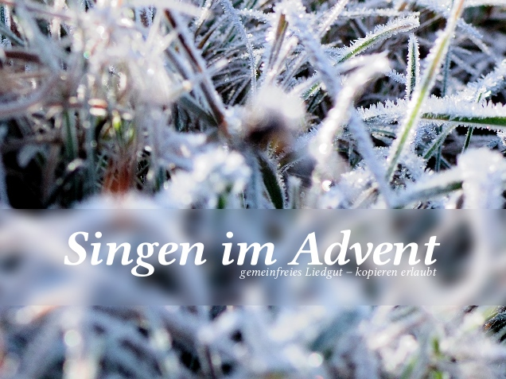

# Singen im Advent

In der dritten Auflage des Liederbuchs "Singen im Advent" sind über 50 klassische Lieder für Weihnachten und die Adventszeit von "A B C, die Katze lief im Schnee" über "Ihr Kinderlein kommet" bis hin zu "Zu Bethlehem geboren" enthalten. Da die Urheber der Lieder bereits seit über 70 Jahren verstorben sind, dürfen alle Noten kostenfrei gesungen, kopiert und verbreitet werden. Die meisten der neu aufgenommenen Lieder sind der "[Ebersberger Liedersammlung](http://ebersberger-liedersammlung.de/)" entnommen, einige wurden aus alten Liederbüchern übertragen. Insgesamt sind in "Singen im Advent“ über 50 Notensätze enthalten.

_Coverfoto: [Sven Scholz](http://www.svenscholz.de/) ([CC-BY-SA](http://creativecommons.org/licenses/by-sa/3.0/de/))_

Zusätzlich zu dem PDF kann die Liedersammlung auch in gedruckter Form für 6,99 Euro [bestellt werden](https://www.epubli.de/shop/buch/Singen-im-Advent-Christian-Hufgard-9783741870316/58512). Dies ist der Mindestpreis, der bei epubli angesetzt werden kann.

## DOWNLOAD
Zum Download des 4,3 MB großen PDFs bitte [hier](https://raw.githubusercontent.com/musikpirat/singen-im-advent.github.io/gh-pages/Singen_im_Advent_-_Auflage_3.pdf) klicken.

Natürlich stehen auch die Rohdaten des Buches zur Verfügung. Sie können unter [https://github.com/Musikpiraten/public-domain-season-songs heruntergeladen]( https://github.com/Musikpiraten/public-domain-season-songs) werden.

## AKTUALISIERUNGEN
Wir freuen uns über "sachdienliche" Hinweisen zu Fehlern oder Verbesserungsmöglichkeiten und nehmen diese auch schnellstmöglich auf. Eine Historie darüber, was wir wann geändert haben, führen wir in der Spalte rechts neben diesem Artikel.

## ENTHALTENE LIEDER
1. A, a, a, der Winter, der ist da
1. A B C, die Katze lief im Schnee
1. Aber heidschi, bumbeidschi, schlaf lange
1. Alle Jahre wieder
1. Als ich bei meinen Schafen wacht'
1. Am Weihnachtsbaume die Lichter brennen
1. Auf, auf, ihr Hirten!
1. Der Christbaum ist der schönste Baum
1. Der Christbaum ist der schönste Baum (Mehrstimmig)
1. Der Heiland ist geboren
1. Ein sehr harter Winter ist
1. Empor zu Gott, mein Lobgesang
1. En gardant ma bergerie
1. Es ist ein Ros’ entsprungen
1. Es ist ein Ros’ entsprungen (Mehrstimmig)
1. Es kommt ein Schiff geladen
1. Es wird schon glei dumpa
1. Es ziehn aus weiter Ferne
1. Freut euch, ihr lieben Christen
1. Fröhliche Weihnacht überall
1. Herbei, o ihr Gläub’gen – Adeste Fideles
1. Herbei, o ihr Gläub’gen – Adeste Fideles (Mehrstimmig)
1. Ich lag und schlief, da träumte mir
1. Ich steh an deiner Krippe hier
1. Ich steh an deiner Krippe hier (Mehrstimmig)
1. Ihr Kinderlein kommet
1. In dulci jubilo
1. Jingle Bells
1. Joseph, lieber Joseph mein
1. Kling, Glöckchen, klingelingeling
1. Kommet, ihr Hirten
1. Lasst uns froh und munter sein
1. Leise rieselt der Schnee
1. Macht hoch die Tür
1. Maria durch ein Dornwald ging
1. Morgen Kinder wird's was geben
1. Morgen kommt der Weihnachtsmann
1. O du fröhliche
1. O Tannenbaum
1. Schneeflöckchen
1. Sei uns willkommen
1. Still, still, still
1. Stille Nacht, heilige Nacht
1. Süßer die Glocken nie klingen
1. Tochter Zion, freue dich
1. Tochter Zion, freue dich
1. Vom Himmel hoch, da komm’ ich her
1. Vom Himmel hoch, ihr Englein kommt
1. Was soll das bedeuten
1. We Wish You A Merry Christmas
1. Winter ade
1. Zu Bethlehem geboren

## HINWEIS:
Einige Liedtexte und Melodien wurden im Laufe des letzten Jahrhunderts verändert. Diese überarbeiteten Versionen unterliegen wie schon die bisherigen Werke bis 70 Jahre nach dem Tod des Urhebers dem Urheberrecht und konnten darum hier nicht aufgenommen werden. Daher verwenden wir die alten, ursprünglichen Fassungen. Diese beinhalten gelegentlich ungewohnte Bestandteile, etwa wenn beim Weihnachtsmannlied der Wunsch nach "Trommel, Pfeife und Gewehr, Fahn und Säbel und noch mehr" gesungen wird.

## HINTERGRUND
Der Hintergrund der Veröffentlichung geht zurück bis ins Jahr 2009. Damals hatte die GEMA zur Weihnachtzeit angefangen, Kindergärten und Vorschulen darauf hinzuweisen, dass das Kopieren von Noten nur mit Genehmigung der Rechteinhaber zulässig sei. Für sich genommen ist das leider richtig, aber bei den meisten Weihnachtsliedern handelt es um Lieder, deren Urheber seit mehr als 70 Jahren verstorben sind. Diese Lieder sind "gemeinfrei", das heisst, niemand kann mehr Rechte an ihnen geltend machen. Im GEMA-Schreiben wurde dies leider nicht erwähnt. Um dieses Wissen zu verbreiten, beschlossenen die Musikpiraten, erstmals ein Buch mit ausschließlich gemeinfreien Weihnachtsliedern zu veröffentlichen.
